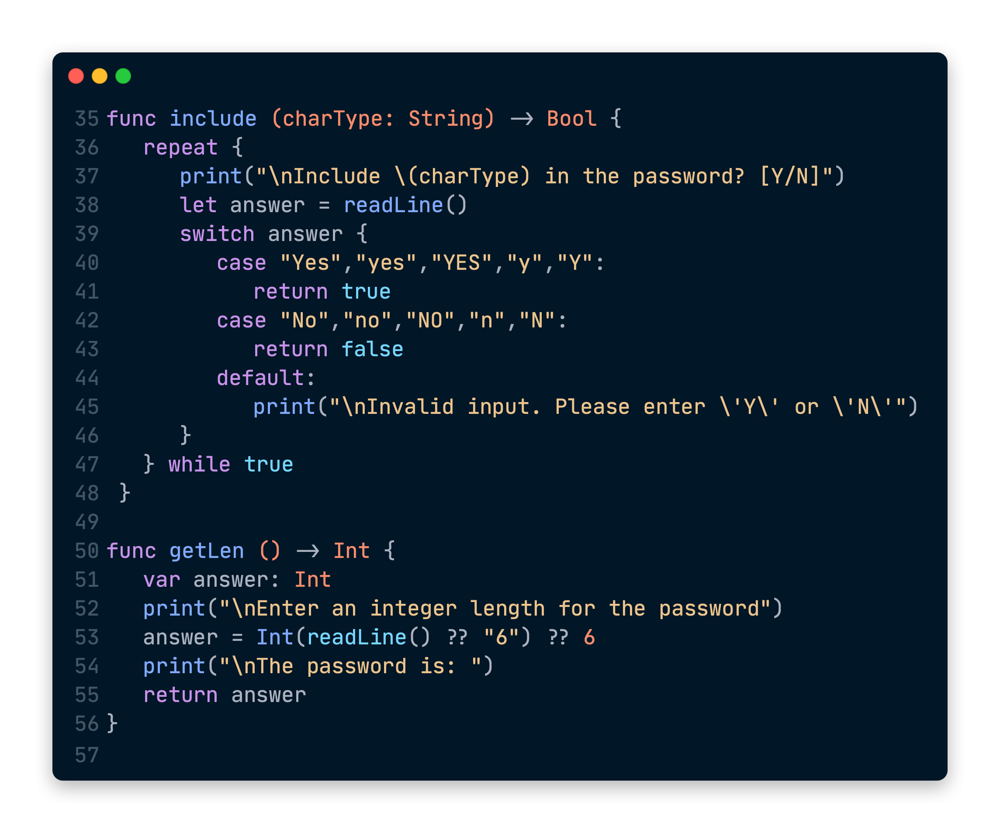
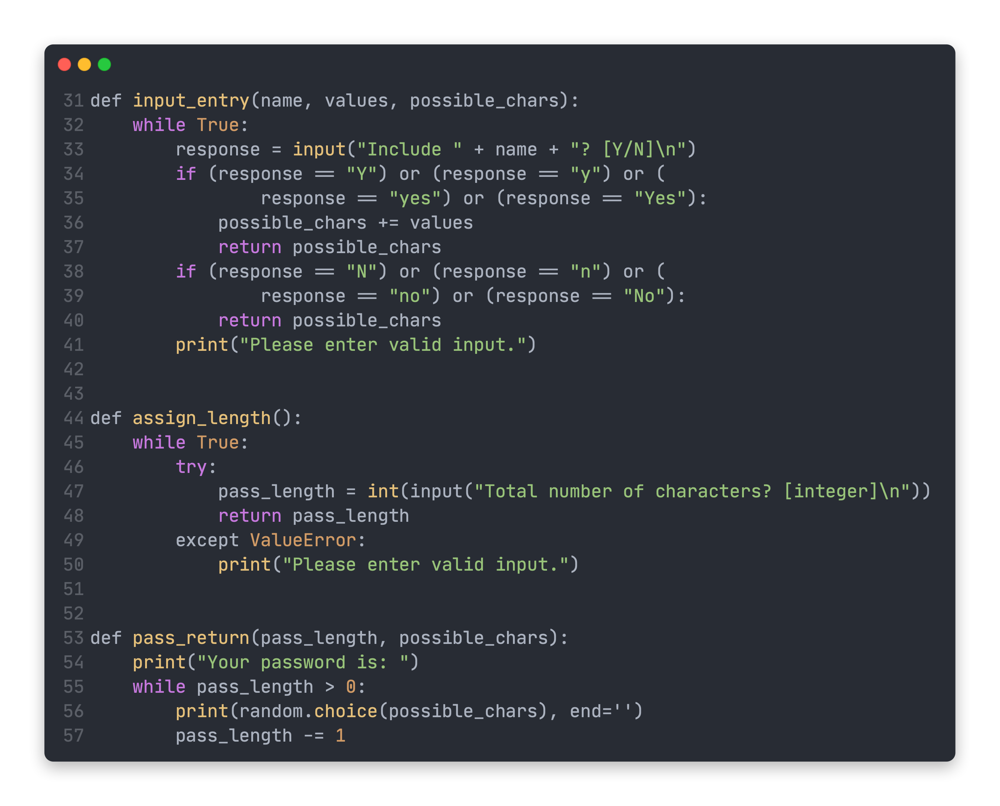
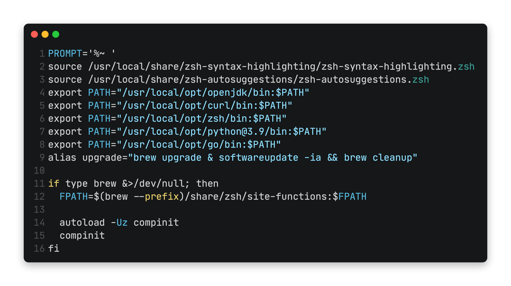

<h1 align="center"> Trevor Opiyo </h1>

 I'm Trevor Opiyo, a software developer with a background in systems programming and shell scripting.  
	
<h3 align="center">**[Resume][resume]** · **[GitHub][github]** · **[Linkedin][linkedin]** · **[Blog][blog]**

---

[github]: https://github.com/Trevor-Opiyo "Click here to see samples of my code"
[rust-passmaker]: https://github.com/Trevor-Opiyo/rust-passmaker "Click here to see my password generator written in rust"
[zshrc]: https://github.com/Trevor-Opiyo/config/blob/master/.zshrc "Click here to see my scripting environment"
[resume]: /resume.pf "Click here to see my contact info"
[linkedin]: https://www.linkedin.com/in/trevor-opiyo-884604165 "Connect with me on Linkedin"
[blog]: /blog/ "Click here to read my blog"